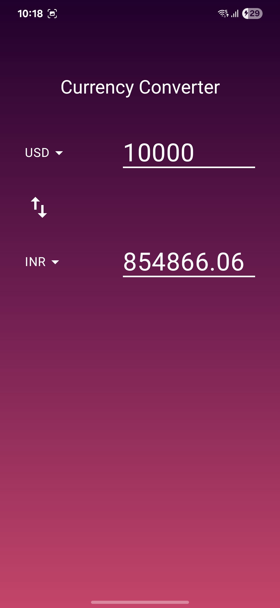

# 🌍 Currency Converter - Kotlin Multiplatform App

A modern **Currency Converter App** built with **Kotlin Multiplatform Mobile (KMM)**. Convert between global currencies with real-time exchange rates, seamless two-way conversion, and platform-specific error handling.

This is a Kotlin Multiplatform project targeting Android, iOS, Desktop.

---

## ✨ Features

- 🌐 Real-time currency exchange via [open.er-api.com](https://open.er-api.com/v6/latest/USD)
- 🔁 Editable inputs for both "From" and "To" fields
- 🔃 Swap currencies and auto-recalculate values
- 💾 Local caching using DataStore (KMM-compatible)
- 💡 Platform-specific error messages (Toast on Android, Alert on iOS)
- ✅ Clean Architecture (Domain, Data, Presentation)

---

## 📸 Screenshots

### Android UI

---

## 🧱 Tech Stack

| Layer         | Technologies |
|--------------|--------------|
| UI           | Jetpack Compose |
| Logic        | Kotlin Multiplatform (KMM), ViewModel |
| Networking   | Ktor client |
| Serialization| Kotlinx Serialization |
| Caching      | DataStore (KMM) |
| DI           | Koin |

---

## ⚙️ Platform Support

This is a **Kotlin Multiplatform** project structured to support:

- ✅ **Android** – fully implemented and tested
- ✅ **Desktop (JVM)** – works via Compose Multiplatform
- ❌ **iOS** – planned, but **not tested** (no access to Apple device or macOS)

> ⚠️ iOS support is stubbed out in the codebase but currently untested due to the unavailability of an Apple development environment.

